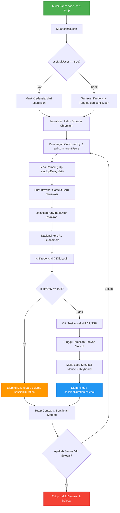

# Dokumentasi Teknis Apache Guacamole Load Tester

Proyek ini adalah skrip pengujian beban (*load testing*) otomatis berbasis **Node.js** dan **Playwright**. Skrip ini dirancang untuk menyimulasikan banyak pengguna (*Virtual Users*) yang masuk ke layanan remote desktop Apache Guacamole secara bersamaan, baik untuk menguji keandalan autentikasi (Tomcat/Database) maupun kinerja *streaming* grafis (`guacd` proxy).

---

## 1. Arsitektur Sistem & Alur Kerja

Skrip ini bekerja dengan meluncurkan satu induk proses browser Chromium (*headless* atau *headful*) dan membaginya ke dalam banyak konteks browser (*Browser Contexts*) terisolasi untuk menghemat memori.

Berikut adalah ilustrasi visual alur eksekusi dari pembacaan konfigurasi hingga penyelesaian sesi:

---

## 2. Struktur Berkas Proyek

Proyek ini terbagi menjadi beberapa file kecil untuk memisahkan logika pemrograman dengan data konfigurasi sensitif:

*   **`load-test.js`**: File logika skrip utama yang menjalankan Playwright.
*   **`config.json`**: Menyimpan konfigurasi global (URL, jumlah pengguna, durasi sesi, headless mode, dan opsi multi-user). *Diabaikan oleh Git.*
*   **`users.json`**: Menyimpan daftar berformat JSON berisi puluhan/ratusan kredensial akun uji untuk pengujian multi-user. *Diabaikan oleh Git.*
*   **`package.json`**: Mengelola pustaka dependensi (Playwright).
*   **`.gitignore`**: Mengamankan file sensitif agar tidak ter-commit ke repositori publik.

---

## 3. Penjelasan Detail Logika Kode (`load-test.js`)

### A. Tahap Pemuatan Konfigurasi
Skrip memuat data konfigurasi menggunakan fungsi penanganan error (`try-catch`):
1. **`CONFIG`**: Dimuat dari `config.json`. Jika file tidak ada, skrip mencetak petunjuk penyalinan berkas contoh dan keluar secara aman (`process.exit(1)`).
2. **`USERS`**: Dimuat dari path file yang diatur di `CONFIG.usersFile` (biasanya `./users.json`) hanya jika parameter `CONFIG.useMultiUser` bernilai `true`. Jika gagal dimuat (misal file korup), skrip beralih secara otomatis ke mode akun tunggal cadangan.

### B. Tahap Inisialisasi Browser (`main()`)
*   Skrip meluncurkan browser Chromium menggunakan parameter optimal untuk pengujian beban:
    *   `--disable-dev-shm-usage`: Menghindari crash kehabisan memori `/dev/shm` di lingkungan Linux/Docker.
    *   `--no-sandbox` & `--disable-setuid-sandbox`: Mengurangi overhead keamanan browser guna menghemat pemakaian CPU server penguji.
*   Menggunakan perulangan asinkron (`Promise.all`) untuk meluncurkan `concurrentUsers` secara bergantian dengan jeda waktu `rampUpDelay` detik.

### C. Siklus Hidup Virtual User (`runVirtualUser()`)
Setiap *Virtual User* (VU) melewati fase berikut:
1.  **Isolasi Sesi**: Membuka `browser.newContext()` dengan resolusi layar tetap (1280x720) dan mengabaikan kesalahan sertifikat SSL (`ignoreHTTPSErrors: true`) agar pengujian di server lokal tetap berjalan mulus.
2.  **Navigasi**: Menuju halaman masuk Apache Guacamole dengan batas waktu muat maksimal 30 detik.
3.  **Autentikasi**: Menargetkan elemen input username dan password, melakukan pengisian data, lalu mengeklik tombol submit.
4.  **Verifikasi Login**: Menunggu elemen daftar koneksi (`.connection-list`, dll.) muncul di layar. Jika muncul dalam waktu 20 detik, VU dinyatakan berhasil masuk.
5.  **Percabangan Mode Pengujian**:
    *   **Mode `loginOnly: true`**: VU berhenti di dashboard utama dan menunggu hingga durasi pengujian selesai. Mode ini **tidak membebani** daemon RDP/SSH (`guacd`).
    *   **Mode `loginOnly: false`**: VU mencari dan mengeklik koneksi RDP/SSH. Skrip mendeteksi streaming WebSocket aktif setelah elemen `<canvas>` remote desktop terdeteksi di layar.
6.  **Simulasi Interaksi**: Saat terhubung ke remote desktop, VU melakukan gerakan kursor mouse secara acak (`page.mouse.move`) dan sesekali menekan tombol `Shift` untuk menyimulasikan ketikan pasif. Ini mencegah server menganggap koneksi sedang *idle* dan memaksa `guacd` memproses perubahan piksel layar secara terus-menerus.
7.  **Pembersihan**: Setelah durasi berakhir atau terjadi kesalahan, context browser segera ditutup untuk membebaskan ruang memori.

---

## 4. Penanganan Kesalahan (Error Handling)

Skrip ini dirancang kokoh terhadap kegagalan jaringan:
*   Jika salah satu VU mengalami kegagalan di tengah jalan (misalnya koneksi diputus oleh Cloudflare atau element tidak termuat karena server lambat), Playwright akan mengambil screenshot layar browser pada saat kegagalan terjadi dan menyimpannya sebagai **`vu-[ID]-error.png`**.
*   Setelah menangkap kegagalan tersebut, VU akan dibersihkan dari RAM secara aman dan VU lain tetap dapat melanjutkan pengujian tanpa merusak alur kerja keseluruhan skrip.
